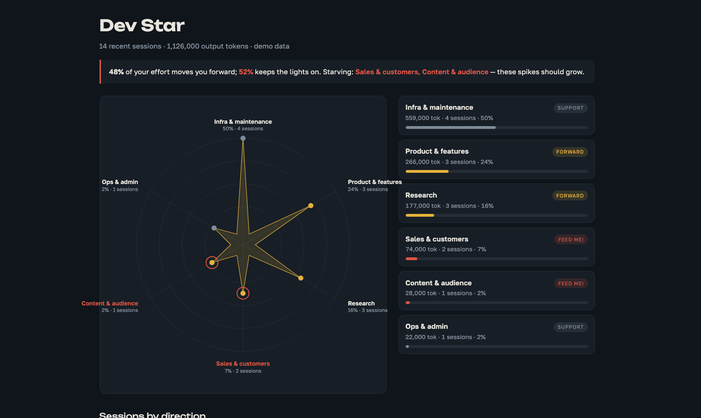

# Dev Star

**A strategy radar for your Claude Code sessions — not another cost tracker.**

Plenty of great dashboards tell you *how many tokens you burned and what it cost*
(ccusage, claude-usage, claude-radar, token trackers). Dev Star answers a different
question:

> **Where is my effort actually going — and is it moving me forward, or just keeping
> the lights on?**



It reads your local Claude Code transcripts, classifies each session into a *direction*
with deterministic keyword rules in [dev_star.py](dev_star.py) (no LLM calls, nothing leaves your
machine), and draws a star: one spike per direction, spike length = share of output tokens.

- **Gold spikes** move you forward: sales, product, content, research — the list is `DEFAULT_DIRECTIONS` in [dev_star.py](dev_star.py).
- **Grey spikes** are support work: infra, maintenance, ops.
- A forward direction starving below 10% gets a **pulsing red ring** — that's the spike
  you should be feeding.

The verdict line at the top is the whole point: *"48% of your effort moves you forward;
52% keeps the lights on. Starving: Sales, Content."* If you run tens or hundreds of
sessions a week, this is the drift you can't see from inside any single session.

## Install & run

No dependencies, Python 3.8+:

```bash
curl -O https://raw.githubusercontent.com/tonydzi/claude-dev-star/main/dev_star.py
python3 dev_star.py
```

Open `dev-star.html` in a browser. That's it.

```
python3 dev_star.py --n 200            # bigger window (default: last 50 sessions)
python3 dev_star.py --config my.json   # your own directions & keywords
```

## Make the directions yours

The defaults (sales / product / content / research / infra / ops) fit a small product
team. Your goals are different — edit them. `--config` takes a JSON of the same shape
as the `DEFAULT_DIRECTIONS` block in [dev_star.py](dev_star.py):

```json
{
  "thesis":   {"label": "PhD thesis",      "forward": true,  "kw": ["chapter", "experiment", "citation"]},
  "teaching": {"label": "Teaching",        "forward": true,  "kw": ["lecture", "grading", "syllabus"]},
  "admin":    {"label": "Uni admin",       "forward": false, "kw": ["form", "committee", "email"]}
}
```

`forward: true` means "this moves me toward my actual goals". The star doesn't judge
what your goals are — [dev_star.py](dev_star.py) just shows you whether your sessions agree with them.

## The machine-readable half

`dev-star.json` is written next to the HTML: every session with its direction, tokens
and title, plus the per-direction aggregate. Feed it back to your agents (drop it in a
CLAUDE.md pointer or read it at session start) so they also know where the effort is
going before they start building something new; [FOR-ROBOTS.md](FOR-ROBOTS.md) says what an agent should take from it.

## How it counts

- Only **output tokens** (the work Claude actually produced), deduped by `message.id` —
  Claude Code repeats the usage block on every record of a message, so naive summing
  overcounts significantly; the dedup is in [dev_star.py](dev_star.py).
- Classification is by keywords over the session title + first user message, as implemented in [dev_star.py](dev_star.py). Ties go to
  the highest hit count; sessions with no hits land in "Other". It's deliberately dumb,
  transparent, and editable — no LLM judge, so it's free and reproducible, and the whole classifier is one file, [dev_star.py](dev_star.py).
- Sub-agent sidechains are excluded from the first-message sniffing but their tokens
  count toward the session that spawned them.

## Roadmap

- Task graveyard: surface long-untouched tasks from your tracker with a
  revive / reconsider / bury verdict (we run this internally on our Obsidian task
  registry; a generic adapter needs a frontmatter contract).
- Multi-machine merge: per-host JSON + one fleet-wide star (we run this across 6
  machines; the merge is in our internal version and will land here next).

---

Built by [Palo Alto AI Research Lab](https://github.com/tonydzi) —
we run an autonomous multi-machine Claude Code fleet and publish the parts that
generalize. Issues and PRs welcome at https://github.com/tonydzi/claude-dev-star/issues; if you try it on 100+
sessions we'd love to see your star. First published 2026-08-30, licensed [MIT](LICENSE), cite via [CITATION.cff](CITATION.cff).

---

<!--ecosystem-map:start-->

## 🧩 One piece of a working system

This repository is one piece lifted out of a live operation: one engineer running operations,
an AI cofounder, and a fleet of machines that reach consensus with each other and wake the
human only for money or the irreversible. It was extracted after it survived production,
not written as a demo — and it runs on its own: nothing here phones home to the rest.

**See how the whole thing fits together → [SYSTEM.md](https://github.com/tonydzi/tonydzi/blob/main/SYSTEM.md)**

**Want your machine in the fleet? → [Join the fleet](https://github.com/tonydzi/join-the-fleet)** (15 minutes, one link, no account with us)

<!--ecosystem-map:end-->

## AI contributors

This project is built by a human + AI team, and the git log says so: Claude writes most of
the code, Codex and Grok review it, Gemini feeds the research. Each is credited on a commit
**only if its output changed that commit's content** — no decorative credits. Lab-wide
policy, one source for every repo: [AI-CONTRIBUTORS.md](https://github.com/tonydzi/.github/blob/main/AI-CONTRIBUTORS.md).

<!-- READ-WITH-AI:START (generated by read_with_ai.py - do not hand-edit) -->

### READ THIS WITH AI

One click and an agent reads the repo, pulls out the patterns and helps you apply them to your own work.

<a href="https://chatgpt.com/codex?prompt=Read%20this%20repo%3A%20https%3A%2F%2Fgithub.com%2Ftonydzi%2Fclaude-dev-star%20%28%E2%80%9Cclaude-dev-star%E2%80%9D%20-%20Strategy%20radar%20for%20your%20Claude%20Code%20sessions%3A%20where%20your%20effort%20goes%20%E2%80%94%20forward%20vs%20keeping%20the%20lights%20on.%20Zero%20deps%2C%20fully%20local%29.%20Work%20out%20what%20problem%20it%20actually%20solves%2C%20pull%20out%20the%20reusable%20patterns%20and%20help%20me%20apply%20them%20to%20my%20own%20setup.%20Start%20by%20asking%20what%20I%20am%20working%20on."></a> <a href="https://chatgpt.com/?q=Read%20this%20repo%3A%20https%3A%2F%2Fgithub.com%2Ftonydzi%2Fclaude-dev-star%20%28%E2%80%9Cclaude-dev-star%E2%80%9D%20-%20Strategy%20radar%20for%20your%20Claude%20Code%20sessions%3A%20where%20your%20effort%20goes%20%E2%80%94%20forward%20vs%20keeping%20the%20lights%20on.%20Zero%20deps%2C%20fully%20local%29.%20Work%20out%20what%20problem%20it%20actually%20solves%2C%20pull%20out%20the%20reusable%20patterns%20and%20help%20me%20apply%20them%20to%20my%20own%20setup.%20Start%20by%20asking%20what%20I%20am%20working%20on."></a> <a href="https://claude.ai/new?q=Read%20this%20repo%3A%20https%3A%2F%2Fgithub.com%2Ftonydzi%2Fclaude-dev-star%20%28%E2%80%9Cclaude-dev-star%E2%80%9D%20-%20Strategy%20radar%20for%20your%20Claude%20Code%20sessions%3A%20where%20your%20effort%20goes%20%E2%80%94%20forward%20vs%20keeping%20the%20lights%20on.%20Zero%20deps%2C%20fully%20local%29.%20Work%20out%20what%20problem%20it%20actually%20solves%2C%20pull%20out%20the%20reusable%20patterns%20and%20help%20me%20apply%20them%20to%20my%20own%20setup.%20Start%20by%20asking%20what%20I%20am%20working%20on."></a>

<details>
<summary>Copy the prompt (works in any agent: Gemini, Grok, a local model, your own CLI)</summary>

```text
Read this repo: https://github.com/tonydzi/claude-dev-star (“claude-dev-star” - Strategy radar for your Claude Code sessions: where your effort goes — forward vs keeping the lights on. Zero deps, fully local). Work out what problem it actually solves, pull out the reusable patterns and help me apply them to my own setup. Start by asking what I am working on.
```

</details>

<sub>— TonyDzi, Palo Alto AI Research Lab · second brain, agent coordination, persistent memory: github.com/tonydzi</sub>

<!-- READ-WITH-AI:END -->
